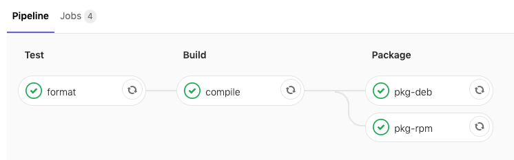

!SLIDE smbullets

# Summary

We now have

* Go app in the `workshop` project with CI tests
* Docker image build in the `docker-fpm` project

What's missing?

* A new pipeline stage for building packages
* Keep it simple stupid with FPM

~~~SECTION:handouts~~~

****

~~~ENDSECTION~~~

!SLIDE smbullets small
# Lab ~~~SECTION:MAJOR~~~.~~~SECTION:MINOR~~~: Add RPM package stage to the Go app

* Objective:
 * Add `pkg-rpm` stage and job to Go app in the `workshop` project
* Steps:
 * Open `Project > Branches` and the `feature/go-app` branch
 * Open the Web IDE and edit `.gitlab-ci.yml`
 * Modify the `stages` array and add `package` after `build`
 * Add a new job `pkg-rpm`

Note that artifacts from all previous stages are passed by default.

    pkg-rpm:
      stage: package
      image: $CI_REGISTRY/osmc/docker-fpm/fpm
      script:
        - fpm -s dir -t rpm -n go-app go-app
        - rpm -qpl *.rpm
      artifacts:
        paths:
          - "*.rpm"

~~~SECTION:handouts~~~

****

~~~ENDSECTION~~~

!SLIDE supplemental solutions
# Lab ~~~SECTION:MAJOR~~~.~~~SECTION:MINOR~~~: Proposed Solution
****

## Add RPM package stage to the Go app

****

Follow the instructions and ask the trainer for help in case.

.gitlab-ci.yml:

    # This file is a template, and might need editing before it works on your project.
    image: golang:latest
    
    variables:
      # Please edit to your GitLab project
      REPO_NAME: 4014-gitlab-b1d71-web.nws.netways.de/osmc/workshop
    
    # The problem is that to be able to use go get, one needs to put
    # the repository in the $GOPATH. So for example if your gitlab domain
    # is gitlab.com, and that your repository is namespace/project, and
    # the default GOPATH being /go, then you'd need to have your
    # repository in /go/src/gitlab.com/namespace/project
    # Thus, making a symbolic link corrects this.
    before_script:
      - mkdir -p $GOPATH/src/$(dirname $REPO_NAME)
      - ln -svf $CI_PROJECT_DIR $GOPATH/src/$REPO_NAME
      - cd $GOPATH/src/$REPO_NAME
    
    stages:
      - test
      - build
      - package
      - deploy
    
    format:
      stage: test
      script:
        - go fmt $(go list ./... | grep -v /vendor/)
        - go vet $(go list ./... | grep -v /vendor/)
        - go test -race $(go list ./... | grep -v /vendor/)
    
    compile:
      stage: build
      script:
        - go build -race -ldflags "-extldflags '-static'" -o $CI_PROJECT_DIR/go-app
      artifacts:
        paths:
          - go-app
    
    pkg-rpm:
      stage: package
      image: $CI_REGISTRY/osmc/docker-fpm/fpm
      script:
        - fpm -s dir -t rpm -n go-app go-app
        - rpm -qpl *.rpm
      artifacts:
        paths:
          - "*.rpm" 

~~~SECTION:handouts~~~

****

~~~ENDSECTION~~~

!SLIDE smbullets small
# Lab ~~~SECTION:MAJOR~~~.~~~SECTION:MINOR~~~: Add DEB package stage to the Go app

* Objective:
 * Add `pkg-deb` stage and job to Go app in the `workshop` project
* Steps:
 * Add a new job `pkg-deb`

Note that artifacts from all previous stages are passed by default.

    pkg-deb:
      stage: package
      image: $CI_REGISTRY/osmc/docker-fpm/fpm
      before_script:
        - apk add tar dpkg
      script:
        - fpm -s dir -t deb -n go-app go-app
        - dpkg-deb -c *.deb
      artifacts:
        paths:
          - "*.deb"  

~~~SECTION:handouts~~~

****

~~~ENDSECTION~~~

!SLIDE supplemental solutions
# Lab ~~~SECTION:MAJOR~~~.~~~SECTION:MINOR~~~: Proposed Solution
****

## Add DEB package stage to the Go app

****

Follow the instructions and ask the trainer for help in case.

.gitlab-ci.yml

    # This file is a template, and might need editing before it works on your project.
    image: golang:latest
    
    variables:
      # Please edit to your GitLab project
      REPO_NAME: 4014-gitlab-b1d71-web.nws.netways.de/osmc/workshop
    
    # The problem is that to be able to use go get, one needs to put
    # the repository in the $GOPATH. So for example if your gitlab domain
    # is gitlab.com, and that your repository is namespace/project, and
    # the default GOPATH being /go, then you'd need to have your
    # repository in /go/src/gitlab.com/namespace/project
    # Thus, making a symbolic link corrects this.
    before_script:
      - mkdir -p $GOPATH/src/$(dirname $REPO_NAME)
      - ln -svf $CI_PROJECT_DIR $GOPATH/src/$REPO_NAME
      - cd $GOPATH/src/$REPO_NAME
    
    stages:
      - test
      - build
      - package
      - deploy
    
    format:
      stage: test
      script:
        - go fmt $(go list ./... | grep -v /vendor/)
        - go vet $(go list ./... | grep -v /vendor/)
        - go test -race $(go list ./... | grep -v /vendor/)
    
    compile:
      stage: build
      script:
        - go build -race -ldflags "-extldflags '-static'" -o $CI_PROJECT_DIR/go-app
      artifacts:
        paths:
          - go-app
    
    pkg-rpm:
      stage: package
      image: $CI_REGISTRY/osmc/docker-fpm/fpm
      script:
        - fpm -s dir -t rpm -n go-app go-app
        - rpm -qpl *.rpm
      artifacts:
        paths:
          - "*.rpm"   
    
    pkg-deb:
      stage: package
      image: $CI_REGISTRY/osmc/docker-fpm/fpm
      before_script:
        - apk add tar dpkg
      script:
        - fpm -s dir -t deb -n go-app go-app
        - dpkg-deb -c *.deb
      artifacts:
        paths:
          - "*.deb"       

~~~SECTION:handouts~~~

****

~~~ENDSECTION~~~

!SLIDE smbullets

# Summary

* Test the code
* Compile Go code into a binary
* Docker image in separate project pushed to CI registry
* Create packages using this container
* Automatically retrieve job artifacts from build to package stage

~~~SECTION:handouts~~~

****

~~~ENDSECTION~~~

