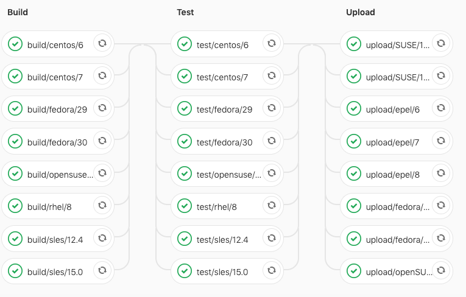

!SLIDE smbullets
# Directed Acyclic Graph

* Pipeline stages need to wait for job completion in each stage
* Since 12.2, jobs can use the `needs:` keyword and start soon enough

https://docs.gitlab.com/ce/ci/directed_acyclic_graph/

~~~SECTION:handouts~~~

****

~~~ENDSECTION~~~

!SLIDE smbullets

# Directed Acyclic Graph: Example Use Case

* Building binary packages for different distributions
* The jobs for Bionic builds could be started once the previous job succeeded
* If your release process requires all jobs, DO NOT enable this for uploads

~~~SECTION:handouts~~~

****

~~~ENDSECTION~~~

!SLIDE smbullets
# Matrix for Build Jobs

Travis CI allows to test multiple language versions, with a build matrix as result.

    language: php

    php:
      - '7.1'
      - '7.2'
      - '7.3'

GitLab currently needs multiple jobs. This should become easier with
https://gitlab.com/gitlab-org/gitlab/issues/15356

~~~SECTION:handouts~~~

****

~~~ENDSECTION~~~

!SLIDE smbullets

