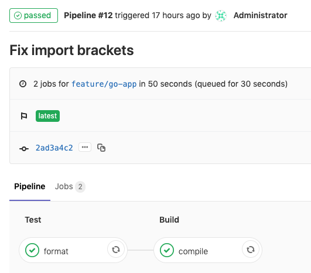

!SLIDE smbullets
# GitLab Pipelines

Code => Build => Test => Deploy

* Encapsulate QA steps into pipelines
* Visible which pipeline is affected
* Halt if one step is failing
* Direct feedback to developers
* CI and CD
  * Continuous Integration
  * Continuous Deployment

~~~SECTION:handouts~~~

****

Reference: https://docs.gitlab.com/ce/ci/pipelines.html

~~~ENDSECTION~~~

!SLIDE smbullets noprint
# GitLab Pipelines: Example

!SLIDE smbullets printonly
# GitLab Pipelines: Example

~~~SECTION:handouts~~~

****

~~~ENDSECTION~~~

!SLIDE smbullets
# Pipeline Configuration

* Inspect the stages for our Go App.

.gitlab-ci.yml:

    stages:
      - test
      - build
      - deploy

* Explain the stage for the `format` job
* Explain the stage for the `compile` job

~~~SECTION:handouts~~~

****

~~~ENDSECTION~~~

!SLIDE smbullets
# Pipeline in GitLab

* Navigate to `CI / CD > Pipelines` and inspect the latest run
* Compare this to previous pipeline runs where it failed before

~~~SECTION:handouts~~~

****

~~~ENDSECTION~~~

